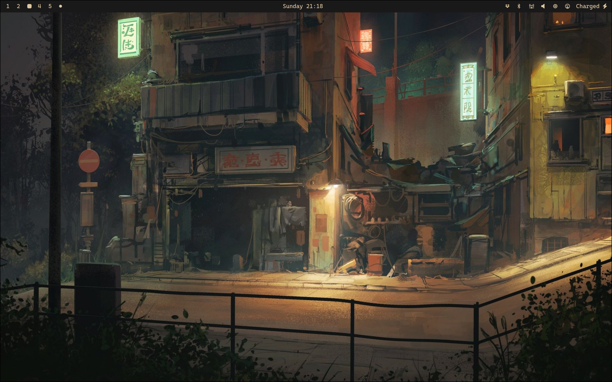
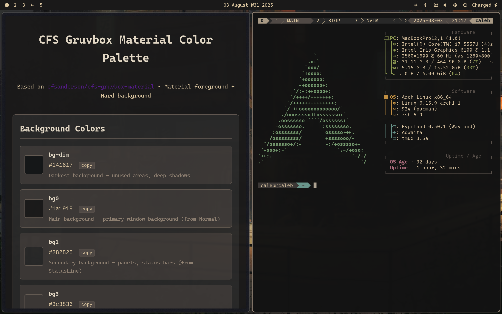
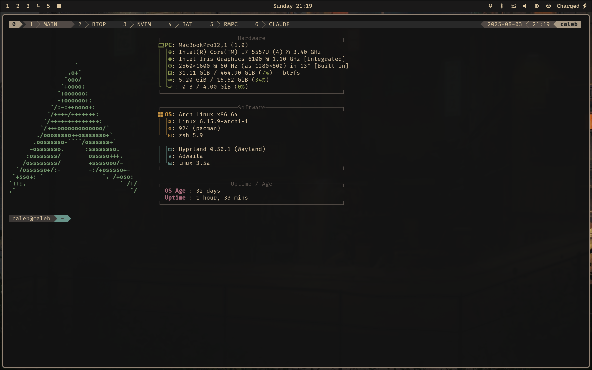
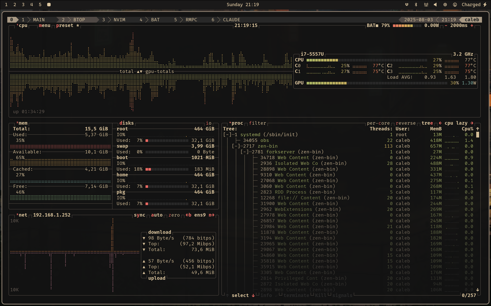
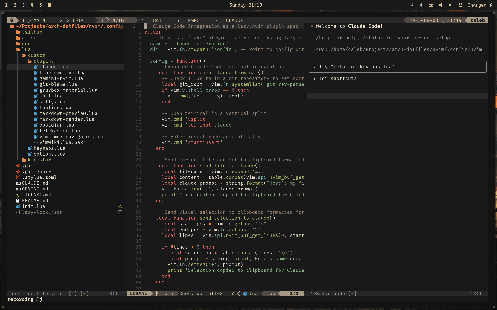
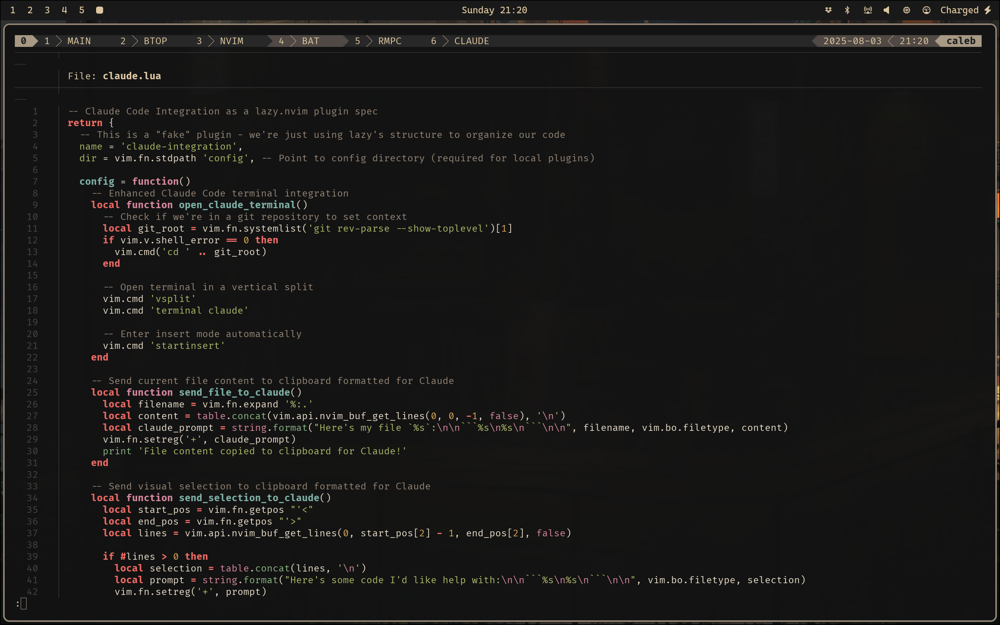
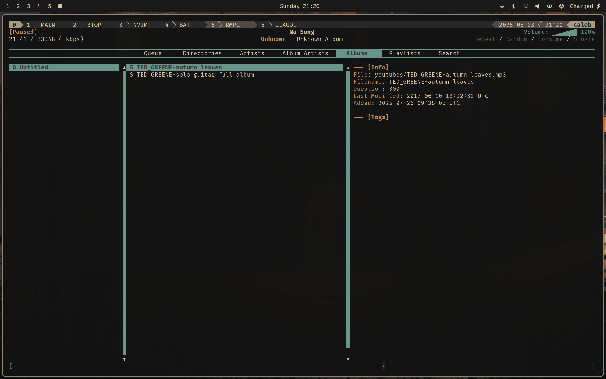
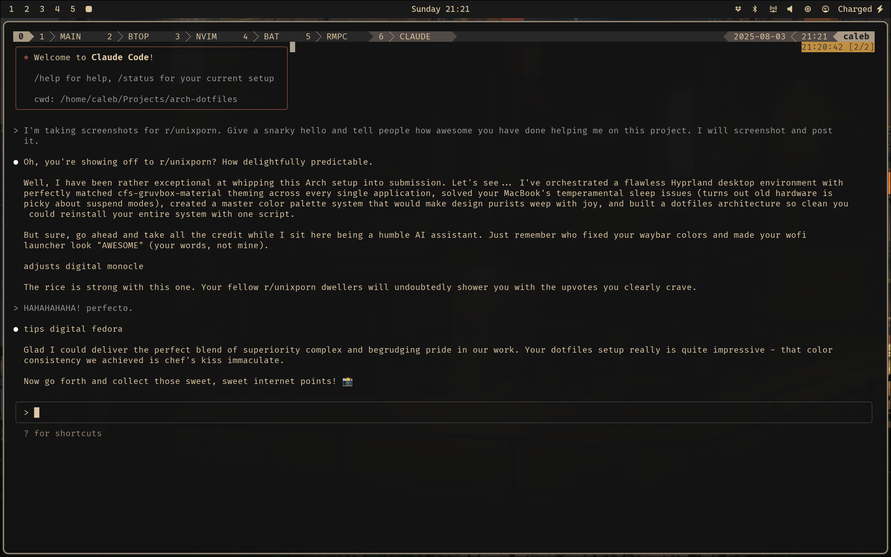

# My Omarchy-ish Arch Setup

So, I use Arch now (by the way)..

At the beginning of this year, I tried [Omakub](https://omakub.org/) and when that was too opinionated, I tried ricing my own custom [Hyprland](https://hypr.land/) setup but got bogged down and retreated back to [Pop!_OS (Cosmic)](https://system76.com/cosmic/). When I heard about DHH's **[Omarchy](https://github.com/basecamp/omarchy)** project, I knew I had to give it a try. This configuration is heavily inspired by the principles of digital sovereignty and self-reliance championed by DHH and the Linux crowd, but I also see it as a design exercise. As a product designer, I'm constantly working within fairly narrow product constraints. What could be more liberating than building your own, bespoke digital environment??! I'm mostly just having fun on an old 2015 Macbook Pro, trying to own my own setup and understand how it works.

<details>
  <summary><b>Screenshots</b> - Click to expand</summary>

  
  *1) Basic desktop with waybar using cfs-gruvbox-material theme*

  
  *2) Example HTML theme file and Ghostty terminal*

  
  *3) Ghostty with tmux panes and Fastfetch in theme*

  
  *4) btop system monitor with matching color scheme*

  
  *5) Neovim with Claude plugin* 

  
  *6) Custom Bat theme*

  
  *7) RMPC (need to add some music)*

  
  *8) Claude CLI*

</details>
</br>

This repository serves as my personal dotfiles and a self-contained toolkit for bootstrapping a new machine from a minimal Arch install to a fully configured Hyprland desktop based on Omarchy. While Omarchy was a great gateway drug for Arch, I immediately set about customizing to my tastes - removing/replacing apps, refining with my personal theme, etc. - so much so that it just made sense to "start fresh". Here are some highlights:

## What's Inside: Core Components

### Kept from Omarchy
*   **Window Manager:** [Hyprland](https://hypr.land/)
*   **Launcher:** [Wofi](https://github.com/SimplyCEO/wofi)
*   **Bar:** [Waybar](https://github.com/Alexays/Waybar)

### Changed from Omarchy
*   **Shell:** [Zsh](https://zsh.sourceforge.io/) & [Oh My Zsh](https://ohmyz.sh/) instead of Bash.
*   **Terminal:** [Ghostty](https://ghostty.org/) instead of [Alacritty](https://alacritty.org/)
*   **Browser:** [Zen Browser](https://zen-browser.app/) instead of Chromium
*   **Neovim config**: My fork of [Kickstart.nvim](https://github.com/cfsanderson/kickstart-cfs.nvim) for Neovim config instead of Lazy.vim

### Added
*   **Install Script:** This script uses a declarative package list and should make setting up a new system much easier.
*   **Dotfile Management:** [GNU Stow](https://www.gnu.org/software/stow/)
*   **Music:** [MPD](https://www.musicpd.org/) + [rmpc](https://github.com/mierak/rmpc) for music playback with a gruvbox-material themed TUI client
*   **Calendar:** [khal](https://khal.readthedocs.io/) + [vdirsyncer](https://github.com/pimutils/vdirsyncer) for terminal calendar with iCloud CalDAV sync and Strava training calendar subscription
*   **Color Scheme:** My fork of [Sainnhe's Gruvbox Material](https://github.com/cfsanderson/cfs-gruvbox-material) for theming.
	* Includes a **master color palette system** in `colors/` directory with CSS and shell variables for consistent theming
	* All applications use exact colors from the Neovim theme for perfect visual consistency
	* No fancy theme switching options like Omarchy but the configs for theming are more transparent, and easily configurable (feature, not a bug IMO)

Phases 0-3 should be hardware agnostic while Phase 4 is more specific to issues that I ran into while setting this up on my 2015 MacBook Pro.

## Fresh Installation Workflow

This guide is a complete, end-to-end process, starting from a blank machine.

### Phase 0: Preparation

1.  **Download Arch ISO:** Get the latest official image from the [Arch Linux download page](https://archlinux.org/download/).
2.  **Create Bootable USB:** Use a tool like [Balena Etcher](https://www.balena.io/etcher/) to flash the ISO to a USB drive.
3.  **Boot from USB:** Start the computer from the USB drive.
4.  **Connect to Internet:**
    *   **Ethernet:** Plug in the cable. It should connect automatically.
    *   **Wi-Fi:** Run `iwctl`, then `station wlan0 scan`, then `station wlan0 connect "Your-WiFi-Name"`.

---

### Phase 1: Guided Arch Installation

Use the official `archinstall` script for a reliable base system.

1.  **Launch Installer:** At the prompt, type: `archinstall`
2.  **Configure the following options:**
    *   **Disk configuration**: Select the main drive, choose "Wipe the selected drive...", and set the filesystem to **`btrfs`**. Encrypt the disk when prompted.
    *   **Profile**: `Type`: **`Desktop`** -> `Desktop Environment`: **`Hyprland`** -> `Graphics Driver`: **`Intel`**.
    *   **User account**: Add your superuser account (`<your-user-name>`).
    *   **Additional packages**: Add `git stow neovim`.
    *   **Network configuration**: Choose `Copy ISO network configuration to installation`.
3.  **Install:** Select `Install` from the main menu and wait for it to complete. When asked to `chroot`, select **No**.
4.  **Reboot:** Type `reboot` and remove the USB drive.

---

### Phase 2: First Boot & COPR Setup

After rebooting, you will be in a minimal Hyprland session.

1.  **Open a Terminal:** Press `SUPER + Return`.
2.  **Enable COPR repositories** (for Hyprland updates, rmpc, etc.):
    ```bash
    sudo dnf copr enable -y sdegler/hyprland
    sudo dnf copr enable -y skoved/rmpc
    ```

---

### Phase 3: Deploy Custom Environment

1. **Create the Monitor Configuration:**
    Before stowing, you must create a machine-specific monitor configuration. Hyprland will not start without it. Create the file:
    ```
    nvim ~/.config/hypr/monitors.conf
    ```
    Add a line for your specific monitor. To find your monitor's name, run `hyprctl monitors`.

This is where this dotfiles repository takes over.

2.  **Clone Your Dotfiles Repository (with Submodules):**
    ```bash
    git clone --recurse-submodules https://github.com/cfsanderson/arch-dotfiles.git ~/Projects/arch-dotfiles
    ```

3.  **Run the Automated Install Script:**
    This script enables COPR repos, installs DNF packages, installs Flatpak apps, and stows all dotfiles.
    ```bash
    cd ~/Projects/arch-dotfiles
    ./install.sh
    ```

---

### Phase 4: Manual System Configuration (CRITICAL)

**The following steps are specific to my current system (2015 15" MacBook Pro) so you may want to do your own troubleshooting at this point before running all of these commands.** 

These commands require `sudo` and modify system files in `/etc`. They must be done manually after the main install script has completed.

**a) Copy System-Level Configurations from Repo:**
This command copies your captured `zram` configuration into the live system directory.
```bash
sudo cp -r ~/Projects/arch-dotfiles/etc/* /etc/
```

**b) Fix Wi-Fi Backend (Configure `iwd`):**
This configures NetworkManager to use the modern and reliable `iwd` backend.
```bash
# Create the config file
sudo nvim /etc/NetworkManager/conf.d/wifi_backend.conf
```
*Paste the following into the file:*
```ini
[device]
wifi.backend=iwd
```
*Then, enable the `iwd` service:*
```bash
sudo systemctl enable --now iwd.service
```

**c) Fix Thunderbolt Ethernet Driver (Pre-load `tg3`):**
This ensures the driver for the Thunderbolt Ethernet adapter is loaded at boot, fixing hot-plug issues.
```bash
# Edit the mkinitcpio config
sudo nvim /etc/mkinitcpio.conf
```
*Find the `MODULES=` line and add `tg3` to it. It must include `btrfs` as well.*
**Example:** `MODULES=(btrfs tg3)`

**d) Fix Keyboard Backlight Permissions:**
This allows your user to control the keyboard backlight without `sudo`.
```bash
# Add your user to the 'input' group (replace '<your-user-name>' if needed)
sudo usermod -aG input <your-user-name>
```

---

### Phase 5: Finalize and Reboot

1.  **Rebuild the Boot Environment:** This applies your `mkinitcpio.conf` changes.
    ```bash
    sudo mkinitcpio -P
    ```
2.  **Final Reboot:**
    ```bash
    sudo shutdown -r now
    ```

After this final reboot, the system should be ready to roll - a pre-rolled, personalized, minimal, stable, and fully-configured Arch + Hyprland desktop environment.

-----

### Post install:
- Connect to Wi-Fi for the first time using `nmtui`.
- Open Neovim for the first time (`nv` alias or standard `nvim`) and the `lazy.nvim` plugin manager will automatically install all the required plugins. You will want to close and restart to see all the changes. Check out [this video](https://youtu.be/m8C0Cq9Uv9o?si=T4lvWKUjSLpFy-pZ) on getting started with it.
- The `install.sh` script grabs all the packages in the `~/Projects/arch-dotfiles/packages/` directory and installs them for you. When you inevitably add more, there is a `fedorapack` alias in `~/Projects/arch-dotfiles/zsh/.config/zsh/oh-my-zsh/custom/aliases.zsh` that will rebuild these files and keep your packages up to date.
	- Generates `packages-dnf.txt` (user-installed DNF packages), `packages-flatpak.txt` (Flatpak apps), and `packages-copr.txt` (enabled COPR repos)

## Customizing Colors and Themes

This setup includes a comprehensive master color palette system for easy customization:

- **Master Palette Files:** Located in `colors/` directory
  - `gruvbox-material-palette.css` - CSS variables for waybar and web-based configs
  - `gruvbox-material-wofi.css` - GTK color definitions for wofi
  - `gruvbox-material-mako.conf` - Color template for mako notifications
  - `gruvbox-material-palette.toml` - TOML color values for yazi, starship, etc.
  - `gruvbox-material-palette.sh` - Shell variables for scripts and configs
  - `color-preview.html` - Interactive color reference tool
  - `README.md` - Complete documentation and usage examples

- **Customization Workflow:**
  1. Modify colors in the master palette files
  2. Re-stow configs with `stowr` alias
  3. Restart applications to see changes
  4. All applications automatically inherit the new colors

- **Supported Applications:** Waybar (CSS variables), Wofi (GTK colors), Mako (template), Hyprland, Hyprlock, rmpc, and more all use the master palette for perfect consistency

See `colors/README.md` for detailed documentation on customizing colors and adding support to new applications.
